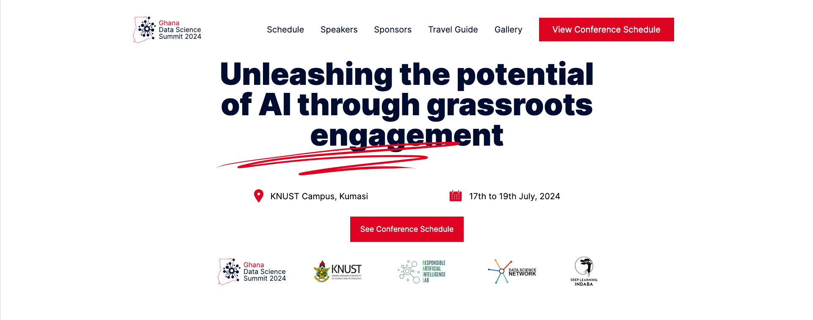

# Ghana Data Science Summit IndabaXGhana'24 Tutorials

Welcome to the tutorials offered at the Ghana Data Science Summit dubbed IndabaXGhana! We have structured the tutorials into three tracks to cater to different levels of expertise: **Beginner**, **Intermediate**, and **Expert**.

*Event Website: [IndabaX Ghana](https://www.indabaxghana.com/)*
This year’s IndabaX Ghana is our 5th annual conference, which aims to strengthen and showcase advancements in the fields of Artificial Intelligence and Machine Learning, particularly in the African context. Over the past 4-5 years, IndabaX Ghana has successfully brought together over 1,000 researchers, professionals, faculty and students in Data Science and Machine Learning in Ghana and beyond. There is a deliberate focus on encouraging more women and youth to attend, having attendees from all sixteen regions in Ghana, and inclusion of recognised minority groups.

## **Beginner Track**
### 1. Building Your First Deep Learning Model
- [Open in Colab](https://colab.research.google.com/drive/1tBPVMRV-nYYdUg8c_UZVxUfAU6QvYRlm?usp=sharing) 

### 2. Python Programming for AI/ML
- [Open in Colab](https://colab.research.google.com/drive/1V519DQbptRKUrhU6Xo5J7h0oEEqtQSay?usp=sharing) 

## **Intermediate Track**
### 3. Object Detection
- [Open in Colab](https://colab.research.google.com/drive/18di_gO8bnK-ifgYR83X9FfXDxvhHBrjC?usp=sharing) 

### 4. Advanced ML on Data Science
- [Open in Colab](https://colab.research.google.com/drive/1xQoSIVjfPzlyQ7uZbly8vbFy7RC6-EIe) 
- [Slides](https://docs.google.com/presentation/d/e/2PACX-1vSK_C-__Wj20lhNVa_HwQROBy2c-gBtdWMuuj2W6XfxO5D-dQvyAsXyIUH1PRU9Mw/pub?start=false&loop=false&delayms=3000)

## **Expert Track**
### 5. Gait Recognition with CNN
- [Open in Colab](https://colab.research.google.com/drive/1oI2dJuix4k35lYUddN_PbncNaqO_Sgbr?usp=sharing) 

### 6. ML in Astronomy 
- [Open in Colab](https://colab.research.google.com/drive/1GR_j0vz7l5S-OE0fO33kbQU_gkrokyyS?usp=sharing)

---

*These tutorials were originally created by Ghana Data Science Summit for the [IndabaX Ghana](https://www.indabaxghana.com/) 2024  Summit and are published under [MIT license](https://choosealicense.com/licenses/mit/).*

